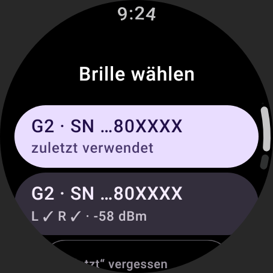
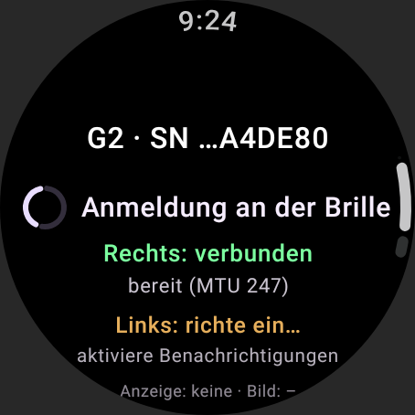
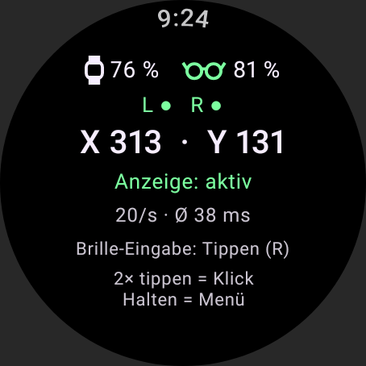
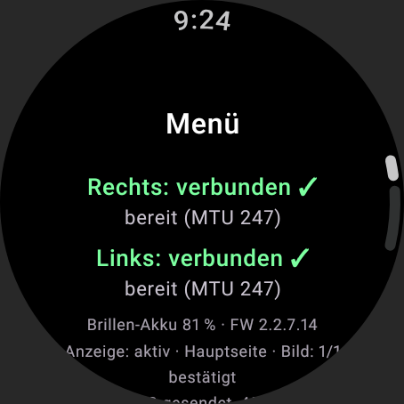
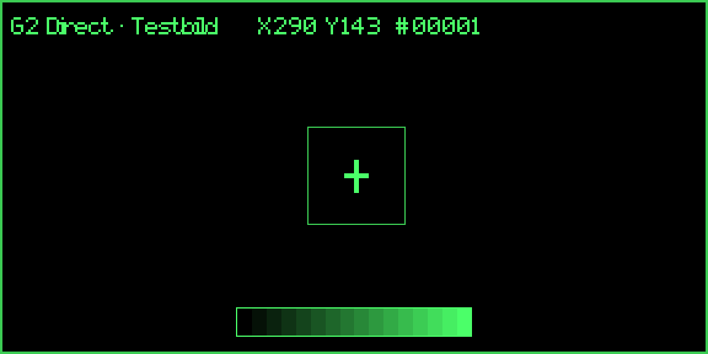
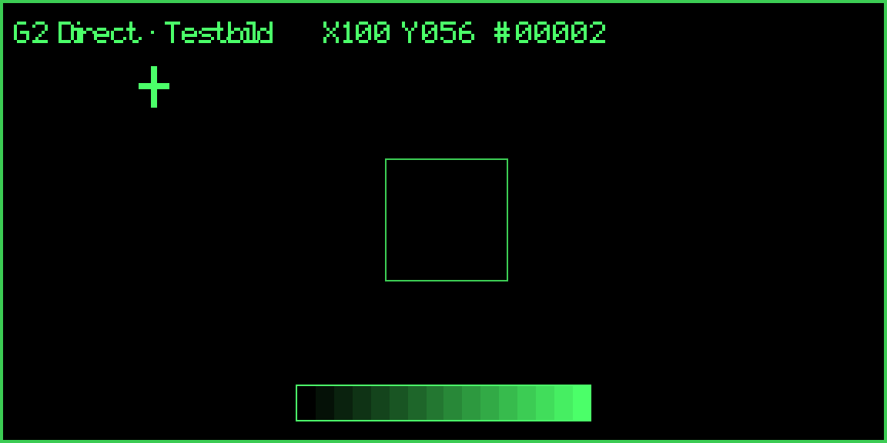
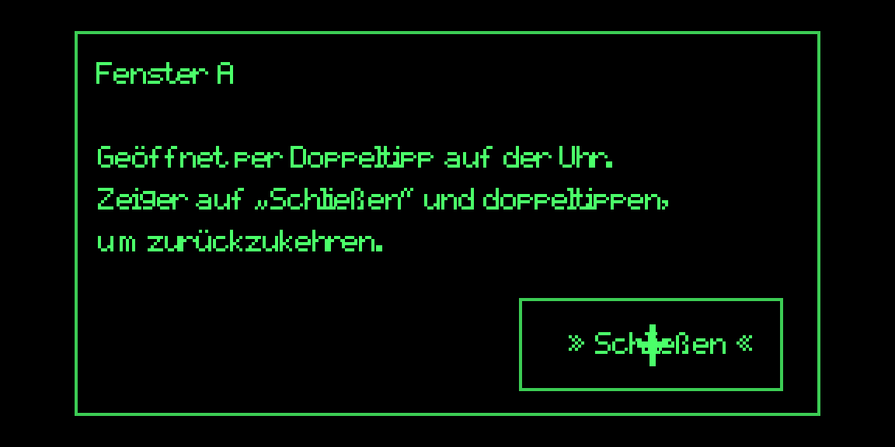

# G2 Direct

G2 Direct ist eine Test-App für Wear OS. Die Pixel Watch verbindet sich per Bluetooth LE **direkt** mit der Even Realities G2, zeigt ein Testbild auf der Brille und bewegt dort ein Fadenkreuz. Das Uhr-Display dient dabei als relatives Touchpad. Im Betrieb ist **kein Smartphone** beteiligt: Die Uhr rechnet und steuert, die Brille zeigt nur an.

> **Stand:** Der erste Test auf echter Hardware (Pixel Watch 5 und G2) hat geklappt: Verbindung zu beiden Bügeln, Testbild, Graukeil und Fadenkreuz erscheinen, der Cursor folgt dem Touchpad. Dabei fiel auf, dass der Cursor ruckelt, weil die Brille jedes Update erst nach ~140 ms bestätigt. **Neu und noch nicht auf Hardware geprüft:** mehrere Updates gleichzeitig (flüssigerer Cursor) sowie Doppeltipp = Klick mit zwei Feldern und einem Fenster.

---

## 1. Welche Schnittstellen es gibt – und welche die App nutzt

| Weg | Ohne Smartphone? | Bewertung |
|---|---|---|
| **Even Hub SDK** (offiziell) | nein | Apps laufen als Web-App im WebView der Even-App auf dem Smartphone. Das Smartphone leitet an die Brille weiter. Das widerspricht der Vorgabe. |
| **BLE-Protokoll der Even-App** (inoffiziell, von der Community entschlüsselt) | **ja** | Wird von MentraOS produktiv auf Android eingesetzt. Ein ESP32-Projekt (AtomS3) zeigt Text auf der G2 ganz ohne Smartphone. **Diese App nutzt diesen Weg.** |
| Eigene Firmware (openCFW) | – | Nur als Nachschlagewerk genutzt, nichts wird auf die Brille geflasht. |

Even Realities dokumentiert **kein** Protokoll für eine direkte Verbindung. Die Einzelheiten und alle Quellen stehen in [docs/PROTOKOLL.md](docs/PROTOKOLL.md).

**Warum das manuelle Koppeln beim alten Prototyp nichts angezeigt hat:** Eine Bluetooth-Kopplung allein bringt nichts auf die Brille. Die Brille zeigt erst etwas an, wenn ein Programm über GATT das Anmelde- und Seitenprotokoll spricht:

1. Anmeldung an beiden Bügeln
2. Kommandorolle für den rechten Bügel
3. Testseite anlegen
4. Inhalte aktualisieren
5. Heartbeats senden

Genau das macht diese App.

```
Pixel Watch (App „G2 Direct“)
 ├─ BLE ─► rechter Bügel: Anmeldung, Zeit, Testseite, Cursor-Updates, Bild, Heartbeats
 └─ BLE ─► linker Bügel:  Anmeldung, Zeit (optional – ohne ihn läuft die App mit Warnung weiter)
```

## 2. Stand: implementiert – getestet – auf Hardware bestätigt

- **Implementiert** heißt: Der Code ist vorhanden und wird gebaut.
- **Getestet** heißt: automatisch geprüft, ohne echte Brille und Uhr. Dazu gehören:
  - Unit-Tests
  - eine Simulation gegen ein Modell der Brille (`FakeGlasses`). Es bildet das dokumentierte Firmware-Verhalten nach und meldet jeden Regelverstoß, z. B. EvenHub-Nachrichten an den linken Bügel, zu viele Container, falsche Längen oder ungültige BMP-Dateien.
  - UI-Tests unter Robolectric, die künstliche Touch-Ereignisse durch den echten Gesten-Code der App schicken
  - gerenderte Screenshots
- Für einige Tests gab es **Mutationsproben**: Absichtlich eingebaute Fehler müssen die Tests scheitern lassen, und das taten sie.

| Funktion | Implementiert | Getestet (ohne Hardware) | Auf echter Hardware |
|---|---|---|---|
| Berechtigung „Geräte in der Nähe“, Bluetooth einschalten | ✅ | Screenshot | ✅ bestätigt |
| Brille suchen: BLE-Scan **plus** bereits gekoppelte und vom System verbundene Bügel | ✅ | Unit-Tests (Namen, Seriennummer, Gruppierung); Robolectric-Test: gekoppelte und verbundene Bügel bleiben über mehrere Scans gelistet | ✅ bestätigt |
| Linken und rechten Bügel zu **einer** Brille zusammenfassen, auch wenn ein gekoppelter Bügel nicht sendet | ✅ | Unit-Tests | ✅ bestätigt |
| Zuletzt verwendete Brille ohne neuen Scan verbinden | ✅ | – | unbestätigt |
| GATT-Verbindung je Bügel: MTU 247, Dienstsuche, Benachrichtigungen, Schreib-Warteschlange | ✅ | nur kompiliert, der Teil braucht echtes Bluetooth | ✅ bestätigt |
| Rahmenformat, CRC, Zerlegen und Zusammensetzen, Antworten dekodieren | ✅ | 13 Unit-Tests, u. a. CRC-Referenzwert und Antworten, die MentraOS mitgeschnitten hat | ✅ bestätigt |
| Anmeldung und Start-Sequenz (Reihenfolge und Abstände wie MentraOS) | ✅ | Simulation | ✅ bestätigt |
| Testbild: Rahmen, Titel- und Infozeile | ✅ | Simulation (Limits, Rückfall von CREATE auf REBUILD) und Layout-Vorschau | ✅ bestätigt |
| Graukeil als 4-Bit-Bild (Bildkanal) | ✅ | Unit-Tests (BMP-Aufbau) und Simulation | ✅ bestätigt |
| Fadenkreuz-Cursor über Textebenen (Einrückung mit U+00A0) | ✅ | Unit-Tests und Simulation mit beiden möglichen Firmware-Lesarten, Mutationsproben | ✅ bestätigt (mit fünf Ebenen; jetzt vier, siehe unten) |
| Relatives Touchpad: kein Sprung beim Neuaufsetzen, gleiche Bewegung ergibt überall gleichen Weg, Halten öffnet das Menü | ✅ | UI-Tests mit künstlichen Touch-Ereignissen, Mutationsprobe | ✅ bestätigt, ruckelte aber (siehe nächste Zeile) |
| Tempo über die Krone (0,3× bis 4×) | ✅ | – | unbestätigt |
| Bis zu 4 Updates gleichzeitig unterwegs (einstellbar 1–8), statt auf jede Bestätigung zu warten | ✅ | Simulation mit 140 ms Antwortzeit: 19,5 statt 7 Cursor-Bewegungen/s | **neu, unbestätigt** |
| Doppeltipp auf der Uhr = Klick: Felder A/B werden unter dem Zeiger mit » « markiert und öffnen ein Fenster, „Schließen“ führt zurück | ✅ | Simulation, UI-Tests (Doppeltipp, Einzeltipp, langsame Tipps) | **neu, unbestätigt** |
| Rückfall auf Festtakt, wenn keine Bestätigungen kommen | ✅ | Simulation | nicht nötig: die Brille bestätigt (Ø 141 ms gemessen) |
| Heartbeats, Neuaufbau nach dem Schließen der Seite durch die Brille | ✅ | Simulation | unbestätigt |
| Neu verbinden (bis zu 3×), Weiterlaufen ohne linken Bügel | ✅ | Simulation | unbestätigt |
| Status und Fehlermeldungen auf der Uhr | ✅ | Screenshots auf dem runden 454-px-Display (große Pixel Watch) | ✅ Touchpad-Anzeige bestätigt |
| Akku-Anzeige oben auf dem Touchpad: Uhr-Symbol mit Akku der Uhr, Brillen-Symbol mit Akku der Brille (⚡ beim Laden; Brillen-Symbol grün/orange/rot je nach Verbindung) | ✅ | Screenshot | **neu, unbestätigt** |
| Protokoll-Ansicht auf der Uhr, `logcat` | ✅ | Screenshot | – |

**Beim ersten Hardware-Test beantwortet:** Die Brille nimmt die Uhr ohne Smartphone an, die Firmware akzeptiert die Testseite und das Bild, sie bestätigt Text-Updates (Ø 141 ms) und stellt die Einrückung mit U+00A0 dar.

**Noch offen:**
1. Wie flüssig läuft der Cursor mit mehreren Updates gleichzeitig? Welche Einstellung unter *Menü → Parallel* passt am besten?
2. Funktionieren Doppeltipp, Markierung der Felder und das Fenster wie in der Simulation?
3. Zeigen beide Linsen das Bild, auch wenn der linke Bügel nicht verbunden ist?

## 3. Vorbereitung

1. Brille laden und **aus dem Etui** nehmen.
2. **Smartphone trennen:** Bluetooth am Smartphone ausschalten oder die Even-App beenden. Solange die Even-App verbunden ist, ist die Brille in der Regel belegt. Dann findet die Uhr sie nicht, oder die Verbindung scheitert mit Fehler 133. Nach dem Test kannst du Bluetooth am Smartphone wieder einschalten.
3. Den **alten Prototyp** auf der Uhr beenden, am besten deinstallieren, damit keine zweite App die Brille belegt.
4. Koppeln in den Uhr-Einstellungen ist **nicht nötig**. Bereits gekoppelte Bügel erscheinen trotzdem in der Liste. Zeigt die Uhr beim Verbinden einen Kopplungsdialog, bestätige ihn.
5. Wenn gar nichts geht: Brille neu starten. Laut [men-g2-ble-gateway](https://github.com/gpsnmeajp/men-g2-ble-gateway) tippst du dazu 5× schnell auf beide Touchflächen.

## 4. Installieren

Die App läuft ab Wear OS 3 (API 30). Sie heißt **G2 Direct**, das Paket `ch.madtreasures.g2direct`.

### A) Fertige APK per WLAN-ADB installieren (ohne Android Studio)

| Was | Link |
|---|---|
| APK (29 MB, Debug-Build, SDK 37) | [g2direct-0.2.1-debug.apk](https://github.com/MADTreasures/ER-G2-Test-2-Claude-5.5-/raw/claude/zen-newton-15o9rd/release/g2direct-0.2.1-debug.apk) |
| Prüfsumme (SHA-256) | [g2direct-0.2.1-debug.apk.sha256](https://github.com/MADTreasures/ER-G2-Test-2-Claude-5.5-/blob/claude/zen-newton-15o9rd/release/g2direct-0.2.1-debug.apk.sha256) |
| `adb` für den Mac, falls nicht über Android Studio installiert | [SDK Platform-Tools](https://developer.android.com/tools/releases/platform-tools) |
| Anleitung von Google: Uhr per WLAN verbinden | [Debug Wear OS over Wi-Fi](https://developer.android.com/training/wearables/get-started/debug-wifi) |

1. Auf der Uhr unter *Einstellungen → Entwickleroptionen* **ADB-Debugging** und **Debugging über WLAN** (englisch *Wireless debugging*) einschalten.
2. Auf dem Mac koppeln und verbinden. Das Koppeln ist nur beim ersten Mal nötig. IP-Adresse, Ports und Code zeigt die Uhr unter *Debugging über WLAN* bzw. *Neues Gerät koppeln*. Der Port zum Verbinden ist ein anderer als der Kopplungsport.
   ```bash
   adb pair <IP>:<Kopplungsport>
   adb connect <IP>:<Port>
   adb devices                    # die Uhr muss als "device" erscheinen
   ```
   Meldet der Mac `command not found: adb`, liegt `adb` im SDK von Android Studio: `export PATH="$HOME/Library/Android/sdk/platform-tools:$PATH"`.
3. APK laden, prüfen, installieren und starten:
   ```bash
   curl -L -o g2direct-0.2.1-debug.apk https://github.com/MADTreasures/ER-G2-Test-2-Claude-5.5-/raw/claude/zen-newton-15o9rd/release/g2direct-0.2.1-debug.apk
   shasum -a 256 g2direct-0.2.1-debug.apk     # muss mit der Prüfsumme oben übereinstimmen
   adb install -r g2direct-0.2.1-debug.apk    # bei mehreren Geräten: adb -s <IP>:<Port> install -r …
   adb shell am start -n ch.madtreasures.g2direct/.MainActivity
   ```

Die APK ist mit einem Debug-Schlüssel signiert. Wechselst du später zu einer selbst gebauten Version oder umgekehrt, bricht `adb install` mit `INSTALL_FAILED_UPDATE_INCOMPATIBLE` ab. Dann zuerst die alte Version entfernen: `adb uninstall ch.madtreasures.g2direct`.

### B) Mit Android Studio bauen (Mac)

| Was | Link |
|---|---|
| Android Studio | [developer.android.com/studio](https://developer.android.com/studio) |
| Quellcode (Branch) | [claude/zen-newton-15o9rd](https://github.com/MADTreasures/ER-G2-Test-2-Claude-5.5-/tree/claude/zen-newton-15o9rd) |
| Quellcode als ZIP | [ZIP herunterladen](https://github.com/MADTreasures/ER-G2-Test-2-Claude-5.5-/archive/refs/heads/claude/zen-newton-15o9rd.zip) |
| Git-URL zum Klonen | `https://github.com/MADTreasures/ER-G2-Test-2-Claude-5.5-.git` |

Voraussetzungen:
- aktuelles Android Studio mit Android SDK Platform 37
- Java 17 bis 25 für Gradle (das in Android Studio enthaltene JBR genügt, Java 25 geht auch)

1. Projekt holen: entweder die ZIP-Datei entpacken oder klonen:
   ```bash
   git clone https://github.com/MADTreasures/ER-G2-Test-2-Claude-5.5-.git
   cd ER-G2-Test-2-Claude-5.5-
   git checkout claude/zen-newton-15o9rd
   ```
2. In Android Studio *File → Open* wählen und den Ordner öffnen. Den Gradle-Sync abwarten. Fehlt die SDK Platform 37, bietet Android Studio die Installation an.
3. Die Uhr wie unter A) per `adb connect` verbinden. Dann oben die Uhr als Gerät und die Konfiguration **app** wählen und ▶ *Run* drücken.

### C) Kommandozeile

```bash
# optional, falls kein Java 17–25 als Standard eingestellt ist:
export JAVA_HOME="/Applications/Android Studio.app/Contents/jbr/Contents/Home"
chmod +x gradlew                 # nur nötig, wenn das Projekt als ZIP geladen wurde
adb devices                      # die Uhr muss als "device" erscheinen
./gradlew :app:installDebug      # bei mehreren Geräten: ANDROID_SERIAL=<IP>:<Port> voranstellen
adb shell am start -n ch.madtreasures.g2direct/.MainActivity
```

Die selbst gebaute APK liegt danach unter `app/build/outputs/apk/debug/app-debug.apk`.

## 5. Bedienung

| Bildschirm | Was du siehst und tun kannst |
|---|---|
| **Berechtigung** | Beim ersten Start „Geräte in der Nähe“ erlauben |
| **Brille wählen** | Jede G2 erscheint als **ein** Eintrag mit beiden Bügeln („L ✓ R ✓“), dazu Signalstärke oder „gekoppelt“. Oben steht „zuletzt verwendet“. **Suchen** startet einen neuen Scan von 25 s. |
| **Status** | Fortschritt je Bügel („verbinde…“, „richte ein…“, „verbunden ✓“), Phase, Anzeige-Status. Fehler stehen rot, Warnungen orange. Während des Aufbaus gibt es **Abbrechen**, nach einem Fehler **Erneut** und **Andere Brille**, immer **Protokoll**. |
| **Touchpad** | Öffnet sich automatisch, sobald alles bereit ist. |
| **Menü** | Akku, Firmware und Zähler. Außerdem: *Testbild neu senden*, *Cursor zentrieren*, Cursor-Form (Fadenkreuz / Fadenkreuz groß / Ring), Tempo, **Parallel** (wie viele Updates gleichzeitig unterwegs sein dürfen: mehr = flüssiger, solange die Brille mitkommt), *Protokoll*, *Trennen* |

Bedienung des Touchpads:
- **Finger irgendwo aufsetzen und bewegen:** Der Cursor bewegt sich relativ. Abheben und woanders neu aufsetzen bewegt ihn nicht.
- **Langsame Bewegung** positioniert fein, **schnelle** Bewegung überquert die Anzeige.
- **Doppeltipp irgendwo** ist ein Mausklick an der Cursor-Position. Die Uhr vibriert kurz.
- **Krone drehen** ändert das Tempo.
- **Finger etwa 1 s ruhig halten** öffnet das Menü, die Uhr vibriert dabei.
- Es gibt keine Pfeiltasten und keine Zonen. Die Texte auf dem Touchpad sind nur Anzeige:
  - oben Akku der Uhr (Uhr-Symbol) und der Brille (Brillen-Symbol)
  - Punkte für den linken und rechten Bügel
  - Cursor-Position
  - „Anzeige: aktiv/unbestätigt/…“
  - Updates pro Sekunde und durchschnittliche Antwortzeit der Brille
  - das Feld unter dem Zeiger bzw. das Ergebnis des letzten Klicks, sonst die letzte Eingabe an der Brille

Weitere Hinweise:
- **Wischen nach rechts schließt die App nicht.** Sonst würde jede Cursorbewegung nach rechts sie beenden.
- Zum Verlassen drückst du die Krone. **Trennen** im Menü schließt die Testseite auf der Brille und beendet die Verbindung.
- Während einer Sitzung bleibt das Uhr-Display an. Das kostet Akku.
- Die App hat keinen Hintergrunddienst. Läuft sie länger im Hintergrund, kann Wear OS sie beenden.

| Brille wählen | Verbindung | Touchpad | Menü |
|---|---|---|---|
|  |  |  |  |

*Die Bilder sind unter Robolectric auf einem simulierten runden Display gerendert, es sind keine Fotos der Uhr.* Weitere Bilder liegen in [docs/screenshots](docs/screenshots): Fehler, Warnung, Protokoll.

## 6. Was du auf der Brille sehen solltest



*Das ist eine Layout-Simulation aus dem Protokollmodell (grobe Ersatzschrift), **kein Foto der Brille**.*

Auf der Brille erscheinen:
- ein Rahmen um die ganze Anzeigefläche (576 × 288)
- oben die Titelzeile `G2 Direct · Testbild` mit Cursor-Position und Update-Zähler
- zwei Felder **Feld A** und **Feld B**
- unten ein Graukeil mit 16 Stufen

Steht der Zeiger auf einem Feld, wird es mit » « markiert. Ein Doppeltipp auf der Uhr öffnet dann ein Fenster; darin führt das Feld **Schließen** (zeigen und doppeltippen) zurück zur Hauptseite:

| Zeiger auf Feld A | Nach dem Doppeltipp |
|---|---|
|  |  |

Das ist normal:
- Über dem Graukeil verschwindet der Cursor, weil die Firmware Bilder über Text zeichnet.
- Der Cursor bewegt sich in Schritten von 5 px waagrecht und etwa 6,75 px senkrecht. Die Standard-Firmware kann Text nicht frei positionieren. Warum der Cursor aus Textebenen besteht, steht in [docs/PROTOKOLL.md](docs/PROTOKOLL.md#5-der-cursor--warum-textebenen).

## 7. Fehlersuche

Die App zeigt Fehler auf der Uhr im Klartext. Das Protokoll im Menü bzw. auf der Statusseite enthält alle Einzelheiten.

| Meldung auf der Uhr | Bedeutung | Was tun |
|---|---|---|
| „Keine G2 gefunden …“ | kein Bügel sendet, keiner ist gekoppelt | Brille aus dem Etui nehmen, Smartphone-Bluetooth ausschalten, **Suchen** |
| „rechter Bügel fehlt – er trägt die Anzeige“ | nur der linke Bügel ist sichtbar | erneut suchen; der rechte Bügel hängt eventuell noch am Smartphone |
| „… 133 (GATT_ERROR – Brille belegt oder nicht erreichbar)“ | Sammelfehler von Android, meist hält ein anderes Gerät die Verbindung | Smartphone-Bluetooth aus, alte App beenden, **Erneut**. Die App versucht es einmal selbst neu. |
| „… 8 (Verbindungs-Timeout …)“, „147“, „Keine Verbindung nach 20 s“ | Brille nicht erreichbar | näher heran, Brille aufsetzen oder aufwecken |
| „… 5“ bzw. „… 15 (… Kopplung prüfen)“ | die Brille verlangt eine Kopplung | Kopplungsdialog bestätigen. Hilft das nicht: Kopplung in den Uhr-Einstellungen entfernen und neu verbinden. |
| „G2-Kanal 5401/5402 nicht gefunden …“ | falsches Gerät oder geänderte Firmware | Protokoll schicken |
| „Keine Anmelde-Bestätigung vom rechten Bügel – versuche trotzdem weiter“ | Warnung | beobachten, ob das Testbild trotzdem erscheint |
| „Brille hat den Seitenaufbau nicht bestätigt – Anzeige prüfen“ | Seite gesendet, keine Antwort | Brille ansehen, Menü → *Testbild neu senden* |
| „Seitenaufbau abgelehnt: …“ | die Firmware lehnt das Layout ab | Protokoll schicken |
| „Brille bestätigt Text-Updates nicht – Festtakt 16/s“ | Hinweis, kein Fehler | Cursor trotzdem bewegen |
| „Testbild geschlossen – Touchpad berühren zum Neuaufbau“ | die Brille hat die Seite beendet, z. B. durch eine Geste am Bügel | Touchpad berühren |
| „Testbild im Hintergrund – Touchpad berühren zum Zurückholen“ | ein anderes Brillen-Menü liegt davor | Touchpad berühren |
| „Linker Bügel nicht verbunden … – weiter nur mit rechts“ | links fehlt | zeigt die linke Linse trotzdem etwas? Bitte notieren. |
| „Verbindung verloren – neuer Versuch n/3“ | Verbindung abgebrochen | die App verbindet bis zu 3× neu |
| „Zu viele Scans in kurzer Zeit – 30 s warten“ | Grenze von Android (5 Scans in 30 s) | kurz warten |

## 8. Test auf echter Hardware

Bitte in dieser Reihenfolge vorgehen und die Beobachtungen notieren:

1. App installieren und starten, verbinden.
2. Erscheint das Testbild mit Rahmen, Titelzeile, **Feld A**, **Feld B** und Graukeil? Auf beiden Linsen?
3. Cursor bewegen:
   - Läuft er jetzt flüssig? Welche Werte zeigt das Touchpad, z. B. „20/s · Ø 140 ms“?
   - Unter *Menü → Parallel* andere Werte ausprobieren (1 = alte, ruckelnde Taktung zum Vergleich; 6 oder 8 = mehr gleichzeitig). Welcher Wert fühlt sich am besten an? Steigt die Antwortzeit („Ø … ms“) dabei stark an?
   - Bleibt er beim Neuaufsetzen stehen? Wie verändert sich das Tempo mit der Krone?
4. Zeiger auf **Feld A**: Erscheint » Feld A «, und zeigt die Uhr „Zeiger auf „Feld A““?
5. **Doppeltippen**: Öffnet sich Fenster A? Zeiger auf **Schließen**, doppeltippen: zurück auf der Hauptseite? Dasselbe mit Feld B.
6. Ein einzelner Tipp darf nichts auslösen und den Cursor nicht verschieben.
7. Etwa 5 Minuten verbunden lassen: Bleibt die Verbindung stabil?
8. Menü → *Trennen*: Verschwindet das Testbild?

**Was du mir zurückschicken kannst:**
- einen Screenshot der Protokoll-Seite
- besser noch das vollständige Log vom Mac aus:
  ```bash
  adb logcat -c
  adb logcat -s G2Direct:V > g2direct-log.txt     # während des Tests laufen lassen, danach Ctrl+C
  ```

Mit diesem Log lassen sich Abweichungen der Firmware gezielt beheben.

## 9. Projektaufbau und Tests

```
app/src/main/java/ch/madtreasures/g2direct/
  protocol/  Rahmen, CRC, Protobuf, Nachrichten, BMP, Testbild, Cursor-Ebenen (reines Kotlin)
  ble/       Scan und Gruppierung, GATT-Verbindung je Bügel, Sitzungslogik (SessionEngine), Android-Anbindung
  ui/        Bildschirme mit Compose for Wear OS
app/src/test/java/ch/madtreasures/g2direct/
  protocol/  Unit-Tests
  ble/       Namen, Gruppierung, Scanner
  sim/       FakeGlasses (Brillen-Modell), Sitzungs-Simulation, Layout-Vorschau
  ui/        Touchpad-Gesten, Screenshots
docs/        PROTOKOLL.md, screenshots/
```

```bash
./gradlew :app:testDebugUnitTest                  # alle Tests (der erste Lauf lädt die Robolectric-Laufzeit, ca. 100 MB)
./gradlew :app:testDebugUnitTest -Pscreenshots    # zusätzlich docs/screenshots neu erzeugen
./gradlew :app:lintDebug
```

Technik:

| Bereich | Version |
|---|---|
| Build | AGP 9.4.1, Gradle 9.7.1 |
| Sprache und UI | Kotlin 2.4.20, Compose for Wear OS (Material 3) 1.7.0 |
| SDK | compileSdk und targetSdk 37, minSdk 30 |

Alle Versionen stehen in `gradle/libs.versions.toml` (Stand September 2026 jeweils die aktuelle stabile Version). Gebaut und getestet mit Java 25.

## 10. Grenzen und Hinweise

- Das Protokoll ist inoffiziell. Ein Firmware-Update der G2 kann es ändern.
- Die App sendet nur Anmelde-, Zeit-, Seiten- und Heartbeat-Nachrichten. Einstellungen der Brille (Dashboard, „Hey Even“, Head-Up) ändert sie **nicht**.
- Dieses Projekt steht in keiner Verbindung zu Even Realities.
- Quellen und Lizenzen: [docs/PROTOKOLL.md](docs/PROTOKOLL.md#7-quellen) und [THIRD_PARTY_NOTICES.md](THIRD_PARTY_NOTICES.md).
